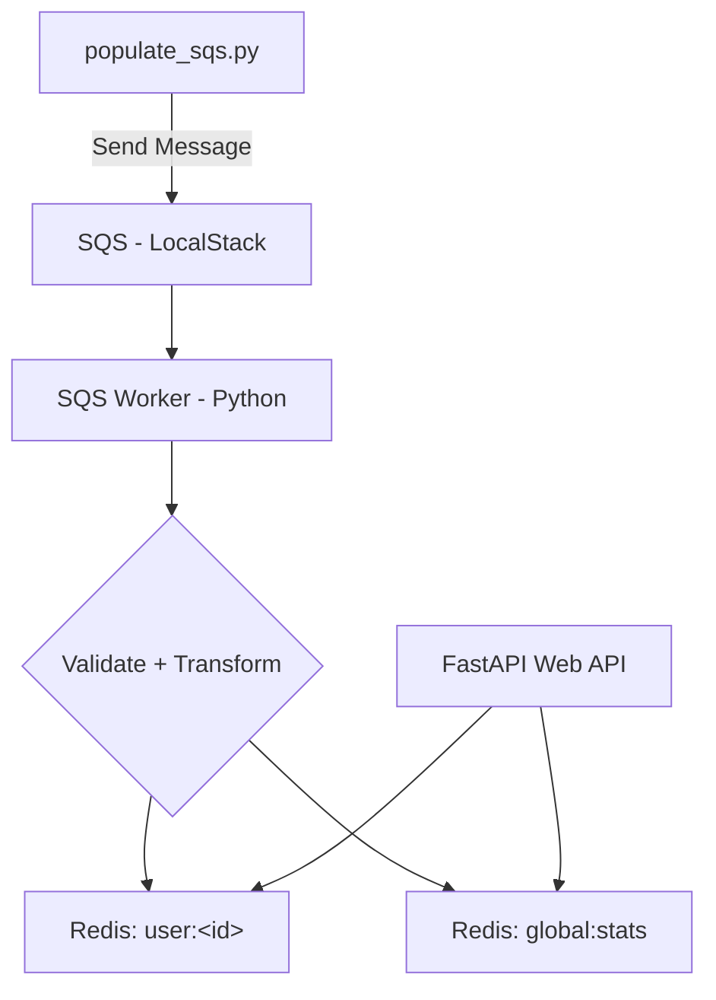

# Ecommerce Data Pipeline

A lightweight, end-to-end data pipeline that simulates the ingestion, transformation, aggregation, and retrieval of e-commerce order events using AWS SQS (via Localstack), Redis, and FastAPI.

### 📦 Project Overview

This project demonstrates a small-scale data pipeline suitable for processing real-time order events from an e-commerce platform. It:

- Ingests messages from an AWS SQS queue.
- Validates and transforms the order data.
- Stores aggregated statistics (user-level and global) in Redis.
- Exposes a REST API for retrieving those stats.

### 🧰 Tech Stack

- Python 3.12
- FastAPI (REST API)
- Redis (In-memory data store)
- LocalStack (mock AWS services)
- Docker + Docker Compose (containerization)

### ⚙️ Setup Instructions

#### Clone the Repository

```bash
git clone <repository-link>
cd ecommerce-data-pipeline
```

#### Start All Services

```bash
docker-compose up --build
```

This will bring up the following services:

- `fastapi-web`: the REST API
- `sqs-worker`: the background processor
- `localstack`: mock AWS SQS
- `redis`: the in-memory data store

#### Populate the SQS Queue

```bash
python scripts/populate_sqs.py
```

### 📬 Example API Usage

#### Get User Statistics

```bash
curl http://localhost:8000/users/U5678/stats
```

**Response**:

```json
{
  "user_id": "U5678",
  "order_count": 10,
  "total_spend": 759.90
}
```

#### Get Global Statistics

```bash
curl http://localhost:8000/stats/global
```

**Response**:

```json
{
  "total_orders": 2500,
  "total_revenue": 199999.95
}
```

### 🧾 Sample Order Message

```json
{
  "order_id": "ORD1234",
  "user_id": "U5678",
  "order_timestamp": "2024-12-13T10:00:00Z",
  "order_value": 99.99,
  "items": [
    { "product_id": "P001", "quantity": 2, "price_per_unit": 20.00 },
    { "product_id": "P002", "quantity": 1, "price_per_unit": 59.99 }
  ],
  "shipping_address": "123 Main St, Springfield",
  "payment_method": "CreditCard"
}
```

### 🏗️ Architecture & Components

**Components**:

- `scripts/populate_sqs.py`: Sends simulated order events to the SQS queue.

- **sqs-worker**:
  - Consumes messages from SQS.
  - Validates `order_value` = sum of all (`quantity * price_per_unit`).
  - Stores stats in Redis:
    - `user:<user_id>`: `{ order_count, total_spend }`
    - `global:stats`: `{ total_orders, total_revenue }`

- **fastapi-web**:
  - `/users/{user_id}/stats` → per-user data
  - `/stats/global` → platform-wide data

### 🗺️ Architecture Diagram (Mermaid)



### 🔧 Design Decisions & Assumptions

- Used Redis for fast reads and writes with simple hash-based schema.
- LocalStack chosen for local AWS simulation.
- Validation ensures `order_value` matches sum of item totals.
- Invalid messages are logged and skipped.
- `populate_sqs.py` mimics event stream without relying on AWS CLI.

### 🚀 Possible Enhancements

- Add `/top-users` endpoint using Redis sorted sets.
- Store monthly aggregates for date-range filtering.
- Add retry logic for failed SQS messages.
- Write unit tests for API and worker logic.

### 📢 Contact

For any questions, reach out to **Gopal** at [gopalvishnupatil@gmail.com](mailto:gopalvishnupatil@gmail.com).
